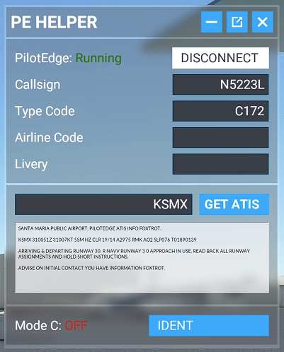

# PE Helper for Microsoft Flight Simulator 2020

This add-on creates a toolbar item allowing you to control the [PilotEdge](https://www.pilotedge.net/) Client from within Microsoft Flight Simulator 2020.

This is a 3rd party add-on for Microsoft Flight Simulator 2020 and PilotEdge and thus support is not provided by Microsoft or PilotEdge.

## Primary Features
- Connect and disconnect from PilotEdge
- Get ATIS for PilotEdge airports
- View Mode C status and Ident

## Install

1. Install, configure, and test the [PilotEdge Pilot Client for Microsoft Flight Simulator 2020](https://www.pilotedge.net/pages/download-software-msfs).
2. Download the [latest release](https://github.com/rcd/msfs-pe-helper/releases/latest) of PE Helper.
3. Extract the release Zip file to your Community folder.
4. Go fly!
 
The usage of this add-on should be mostly self explanitory if you configured and tested the PilotEdge Pilot Client in step 1.

## Known Issues

- ATIS can be difficult to read. This is due to some limitations in how the PilotEdge API can be accessed from MSFS.
- It can be difficult to see if a text input box is disabled or not.
- The text input boxes sometimes have difficulty getting focus. Alt+Tab out of MSFS and then go back into MSFS. This usually fixes the issue.
- Can't tab between controls.
- The toolbar icon is ugly. I'm a developer, not an artist. :P

## Credit

- Thank you to the PilotEdge team for their support during the development process and their blessing to release this add-on.
- Thanks to [Felipe](https://github.com/bymaximus) for his [template project](https://github.com/bymaximus/msfs2020-toolbar-window-template) that gave me a running start on this project.